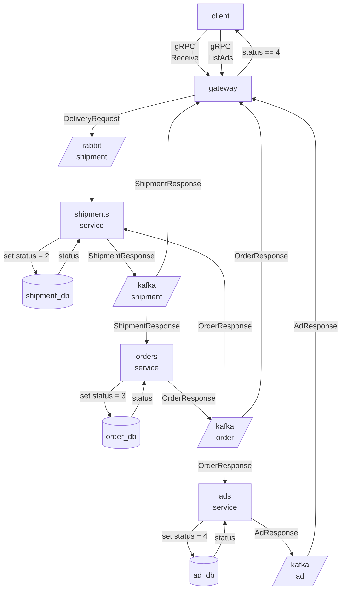

```mermaid
graph TD;
    client -- gRPC<br>Receive --> gateway
    gateway -- DeliveryRequest --> rabbit_shipment[/rabbit<br>shipment/]
    rabbit_shipment --> shipments[shipments<br>service]
    shipments -- set status = 2 --> shipment_db[(shipment_db)]
    shipment_db -- status --> shipments
    shipments -- ShipmentResponse --> kafka_shiping[/kafka<br>shipment/]
    kafka_shiping -- ShipmentResponse --> orders[orders<br>service]
    orders -- set status = 3 --> order_db[(order_db)]
    order_db -- status --> orders
    orders -- OrderResponse --> kafka_order[/kafka<br>order/]
    kafka_order -- OrderResponse --> ads[ads<br>service]
    kafka_order -- OrderResponse --> shipments
    ads -- set status = 4 --> ad_db[(ad_db)]
    ad_db -- status --> ads
    ads -- AdResponse --> kafka_ad[/kafka<br>ad/]
    client -- gRPC<br>ListAds --> gateway
    gateway -- status == 4 --> client
    kafka_shiping -- ShipmentResponse --> gateway
    kafka_order -- OrderResponse --> gateway
    kafka_ad -- AdResponse --> gateway
```